# ⚡ KORTEX: Agentic Knowledge Copilot
## Technical System Documentation & Architectural Analysis

**Version:** 1.0.0  
**Status:** Production-Grade Prototype  
**Framework:** FastAPI + React + Multi-Agent RAG  

---

## 1. Executive Summary
KORTEX is an autonomous **Agentic Knowledge Copilot** designed to consolidate enterprise knowledge from disparate sources—specifically static technical documentation (SOPs) and dynamic historical records (IT Support Tickets). 

By employing a **ReAct (Reasoning and Acting) orchestration loop**, KORTEX moves beyond simple search-and-generate patterns. It uses a dedicated **Planning Agent** to iteratively explore knowledge bases, evaluate the quality of retrieved data, and provide answers that are both technically grounded and fully explainable.

---

## 2. System Architecture

KORTEX follows a **Modular Agentic Loop** pattern, where a central orchestrator delegates tasks to specialized agents based on a dynamic plan.

### High-Level Flow
1.  **Query Ingestion:** User query enters via FastAPI.
2.  **Planning Phase:** The `PlanningAgent` (LLM-driven) analyzes the query and the current observation history to decide the next action.
3.  **Execution Loop:** 
    *   **Retrieval:** Searching PDF SOPs or historical tickets via FAISS.
    *   **Reranking:** Validating semantic relevance via a local Cross-Encoder.
    *   **Synthesis:** Generating a response grounded in the selected context.
    *   **Validation:** Computing a multi-factor confidence score.
4.  **Final Response:** Once confidence thresholds are met (>= 0.5), the answer is returned with citations and a full XAI trace.

### Architecture Diagram (Mermaid)

```mermaid
graph TD
    User([User Query]) --> API[FastAPI Entry Point]
    API --> ORCH[Orchestrator]
    
    subgraph "Agentic Reasoning Loop"
        ORCH --> PLAN[Planning Agent]
        PLAN -- "Decide Action" --> EXEC{Tool Executor}
        EXEC -- "doc_search" --> DOC[Retrieval Agent]
        EXEC -- "ticket_search" --> TICKET[Ticket Agent]
        EXEC -- "synthesize" --> SYNTH[Synthesis Agent]
        EXEC -- "validate" --> VAL[Validator Agent]
        
        DOC --> OBS[Observation]
        TICKET --> OBS
        SYNTH --> OBS
        VAL --> OBS
        OBS --> PLAN
    end
    
    VAL -- "Respond" --> SUCCESS[Final Answer + Citations]
    VAL -- "Escalate" --> HUMAN[IT Support Escalation]
```

---

## 3. Agent Specifications

| Agent | Module | Role | Core Logic |
| :--- | :--- | :--- | :--- |
| **Planning** | `planning_agent.py` | Loop controller; decides tool use. | LLM (Few-shot ReAct) |
| **Triage** | `triage_agent.py` | Initial intent classification. | Heuristic (Keyword Match) |
| **Retrieval** | `retrieval_agent.py` | Semantic search in document index. | FAISS + all-MiniLM-L6-v2 |
| **Ticket** | `ticket_agent.py` | Semantic search in ticket database. | FAISS + all-MiniLM-L6-v2 |
| **Reranker** | `reranker_agent.py` | Precise relevance scoring. | Cross-Encoder (MiniLM-L-6) |
| **Synthesis** | `synthesis_agent.py` | Grounded answer generation. | LLM (Prompt Engineering) |
| **Validator** | `validator_agent.py` | Hallucination & confidence check. | Weighted Multi-Factor Formula |

---

## 4. The RAG Pipeline

### 4.1. Data Ingestion & Sanitization
KORTEX prioritizes data security and retrieval quality during ingestion:
*   **PII Redaction:** A dedicated `redact_pii` utility uses high-fidelity regex patterns to strip sensitive emails and phone numbers before embedding.
*   **Recursive Character Chunking:** Unlike naive splitting, KORTEX uses recursive splitting (`\n\n` -> `\n` -> ` `) to ensure document structure (like headers and paragraphs) remains intact within chunks.

### 4.2. Vector Storage
*   **Engine:** FAISS (Facebook AI Similarity Search).
*   **Metric:** `IndexFlatIP` (Inner Product) for normalized cosine similarity.
*   **Dual-Index Strategy:** Separate indices for `docs` (technical guides) and `tickets` (incident history) to allow targeted searching.

### 4.3. Semantic Reranking
To eliminate the "noise" of vector-only retrieval, KORTEX runs a local **Cross-Encoder** (`ms-marco-MiniLM-L-6-v2`). This model evaluates the specific relationship between the query and each chunk, producing a normalized `reranker_score`.

---

## 5. Explainable AI (XAI) Implementation

Transparency is a core mandate of KORTEX. Every response includes an `xai_explanation` array.

### 5.1. Confidence Scoring Formula
The system computes a final confidence score ($C$) based on four distinct vectors:
$$C = (0.3 \times Retrieval) + (0.25 \times Reranker) + (0.15 \times SelfEval) + (0.3 \times Faithfulness)$$

*   **Retrieval:** Raw vector similarity score.
*   **Reranker:** Cross-encoder relevance score.
*   **SelfEval:** The LLM's own assessment of its answer quality.
*   **Faithfulness:** A dedicated check to ensure every claim in the answer is supported by the context.

### 5.2. Decision Thresholds
*   **$C \ge 0.5$**: Respond to user.
*   **$0.35 \le C < 0.5$**: Attempt auto-retry with expanded search (`top_k` expansion).
*   **$C < 0.35$**: Flag as "Escalated" and prompt for human intervention.

---

## 6. Implementation Details

### Backend (Python/FastAPI)
*   **Orchestration:** Sequential and parallel execution of agent tools within a step-limited loop (max 5 steps).
*   **LLM Flexibility:** Built-in support for multiple providers (Gemini, OpenAI, Ollama, Groq) via a unified `LLMClient`.
*   **Persistence:** Uses local JSON metadata storage for rapid retrieval and mapping of FAISS indices to human-readable sources.

### Frontend (React/Vite)
*   **Pipeline Visualization:** A real-time trace shows which agent is currently active.
*   **Interactive XAI:** Users can inspect the "WHY" behind every step in the agent activity panel.
*   **Source Citation:** Answers include clickable citations that link back to the specific PDF page or Ticket ID.

---

## 7. Security & Privacy
*   **No PII in Embeddings:** Sensitive data is redacted during the pre-processing phase.
*   **Local Processing:** Reranking and embedding generation happen on-server (local CPU/GPU), ensuring sensitive text content is not sent to third-party reranker APIs.
*   **Context Grounding:** The `SynthesisAgent` is strictly instructed to say "I don't know" if the provided context is insufficient, mitigating the risk of creative hallucinations.

---

## 8. Evaluation & Maturity

| Metric | Status | Note |
| :--- | :--- | :--- |
| **Accuracy** | High | Reranker + Faithfulness check ensures high precision. |
| **Latency** | Moderate | Agentic loops add 2-5s overhead depending on model provider. |
| **Explainability** | Industry-Leading | Full decision trace for every query. |
| **Scalability** | Horizontal | Backend is stateless; FAISS indices can be sharded or moved to a vector DB. |

---

## 9. Future Roadmap
1.  **Hybrid Search:** Integrate BM25 keyword search to complement semantic vector search.
2.  **Streaming XAI:** Transition from polling/post-response traces to real-time agent updates via WebSockets.
3.  **Knowledge Graph:** Implement a graph layer to connect related SOPs and incidents across different departments.
4.  **Feedback Loop:** Allow human engineers to "validate" or "correct" agent findings, with corrections fed back into the reranker's training set.

---
**KORTEX Technical Report**  
*Generated by Principal AI Architect*  
*April 2026*
